# EMC (Early Morning Commander) 

EMC standalone desktop aims to be a lightweight alternative to conventional desktop environments based on a minimal Debian installation and a collection of configuration files and scripts for controlling i3 and polybar.  
  
Unlike standard i3, EMC is mouse-controlled like a conventional desktop environment, while maintaining i3's keyboard efficiency.  
EMC thus combines the convenience of a traditional desktop with the performance of a tiling window manager.  
  
**Note:** some screenshots for minor changes may not be up to date. This will be updated in alpha version.
  
<details>
<summary>Overview</summary>

<br>Screenshots:
  
<table align="left" style="border: none; border-collapse: collapse;">
  <!-- row 1: Info-->
  <tr>
    <td align="center" style="padding-right: 15px; padding-bottom: 5px;">
      <a href="screenshots/overview/01_EMC_Mainbar_info.png" target="_blank">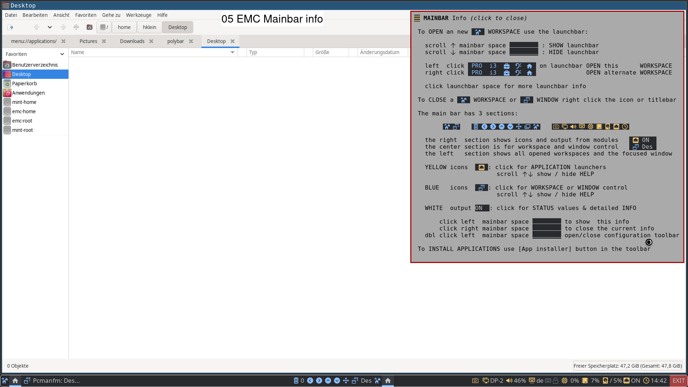</a>
    </td>
    <td align="center" style="padding-right: 15px; padding-bottom: 5px;">
      <a href="screenshots/overview/02_EMC_Launchbar_info.png" target="_blank">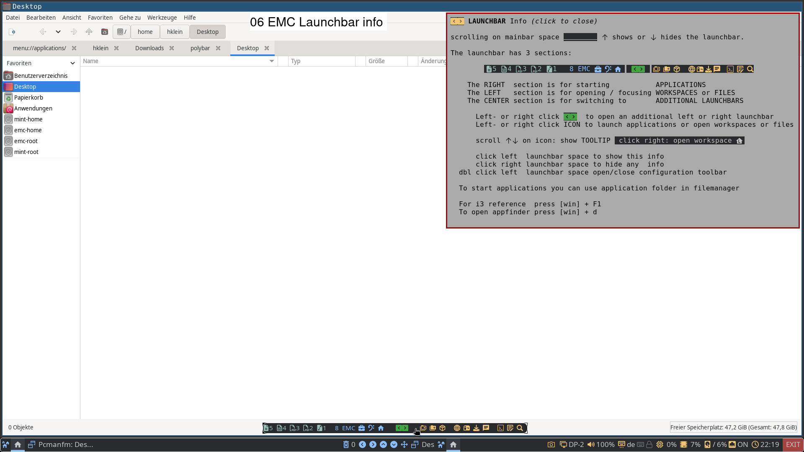</a>
    </td>
    <td align="center" style="padding-right: 15px; padding-bottom: 5px;">
      <a href="screenshots/overview/03_control_workspace_info.png" target="_blank">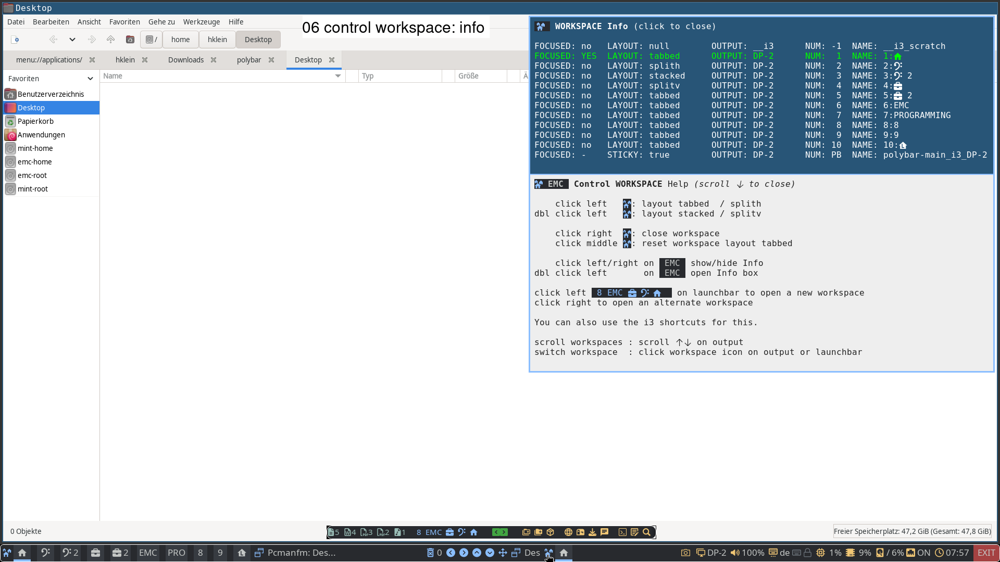</a>
    </td>
    <td align="center" style="padding-bottom: 5px;">
      <a href="screenshots/overview/04_control_windows_info.png" target="_blank">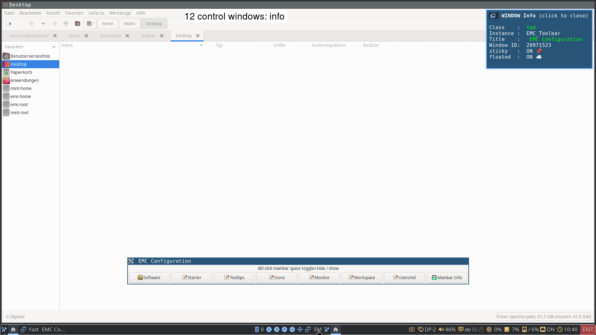</a>
    </td>
  </tr>
  <tr>
    <td align="center" style="padding-right: 15px; padding-bottom: 15px;"><small>Mainbar Info</small></td>
    <td align="center" style="padding-right: 15px; padding-bottom: 15px;"><small>Launchbar Info</small></td>
    <td align="center" style="padding-right: 15px; padding-bottom: 15px;"><small>Control Workspace</small></td>
    <td align="center" style="padding-bottom: 15px;"><small>Control Window</small></td>
  </tr>
  
  <!-- row 2: Help/More -->
  <tr>
    <td align="center" style="padding-right: 15px; padding-bottom: 5px;">
      <a href="screenshots/overview/05_EMC_Display_help_1920.png" target="_blank">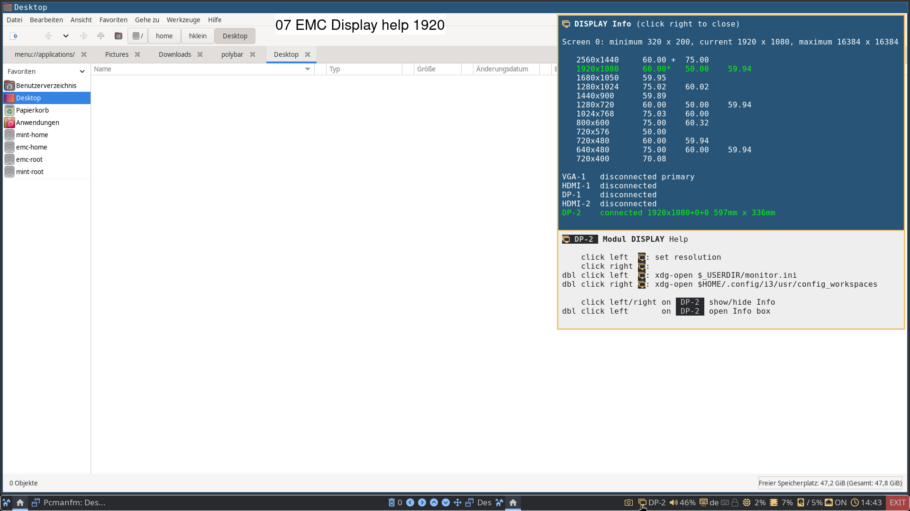</a>
    </td>
    <td align="center" style="padding-right: 15px; padding-bottom: 5px;">
      <a href="screenshots/overview/06_EMC_Toolbar_Config.png" target="_blank">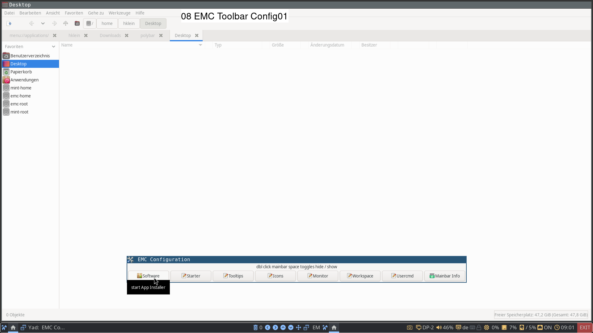</a>
    </td>
    <td align="center" style="padding-right: 15px; padding-bottom: 5px;">
      <a href="screenshots/overview/07_EMC_App_installer_first_run.png" target="_blank">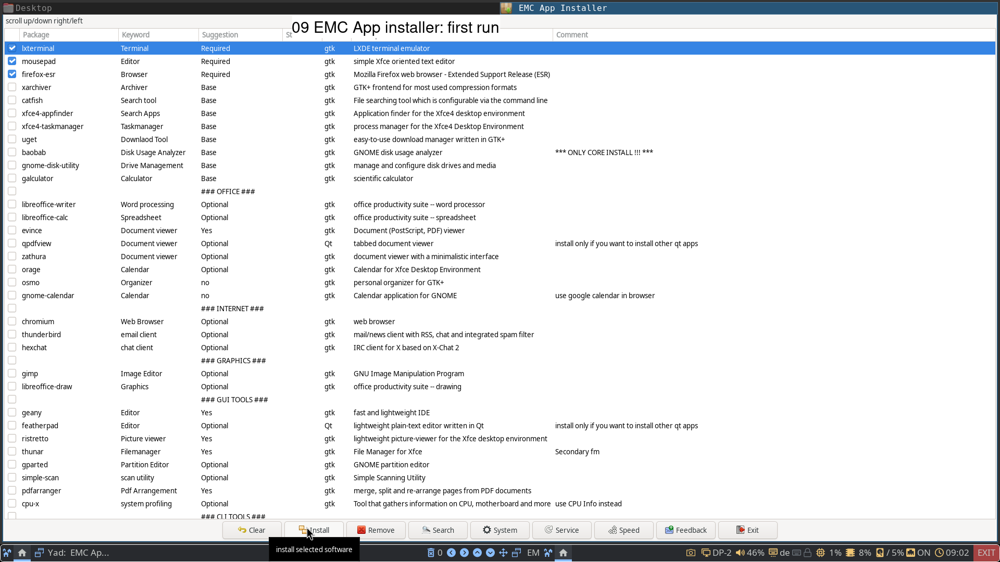</a>
    </td>
    <td align="center" style="padding-bottom: 5px;">
      <a href="screenshots/overview/08_EMC_Overview_ireal_pro.png" target="_blank">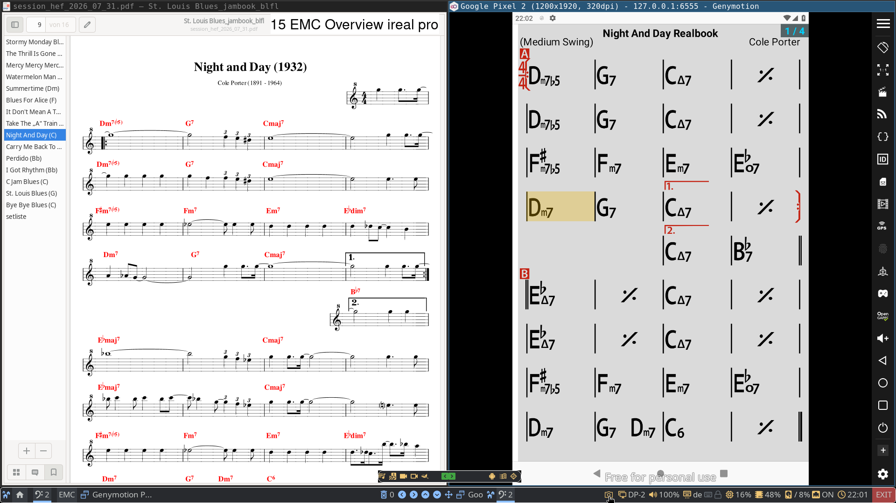</a>
    </td>
  </tr>
  <tr>
    <td align="center" style="padding-right: 15px;"><small>Display Info</small></td>
    <td align="center" style="padding-right: 15px;"><small>Toolbar Config</small></td>
    <td align="center" style="padding-right: 15px;"><small>App Installer</small></td>
    <td align="center"><small>Running iReal Pro</small></td>
  </tr>
</table>

<br clear="all">

```
right click the screenshots to open them in another tab
keeps this overwiew opened
```

  
download [First steps](screenshots/archives/EMC_First_steps.tar.gz) screenshot archive  

</details>

<details>
<summary>Monitor resolutions</summary>

<br>Screenshots:

<table align="left" style="border: none; border-collapse: collapse;">
  <tr>
    <td align="center" style="padding-right: 10px;">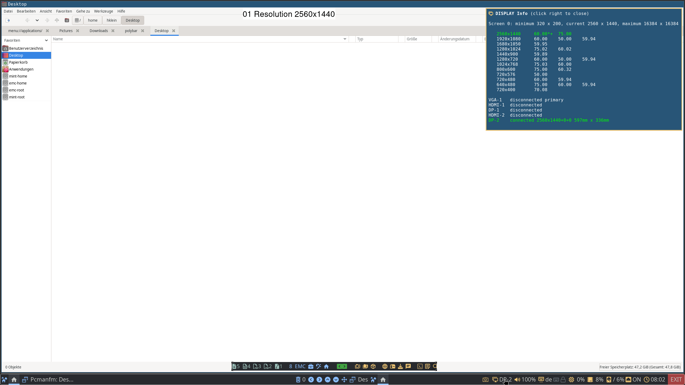</td>
    <td align="center" style="padding-right: 10px;">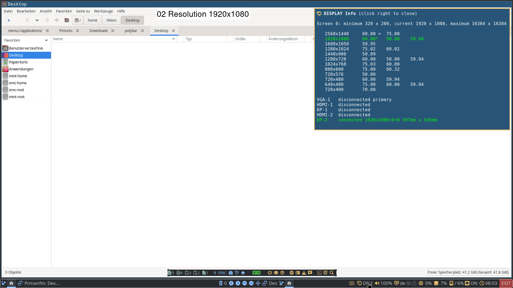</td>
    <td align="center" style="padding-right: 10px;">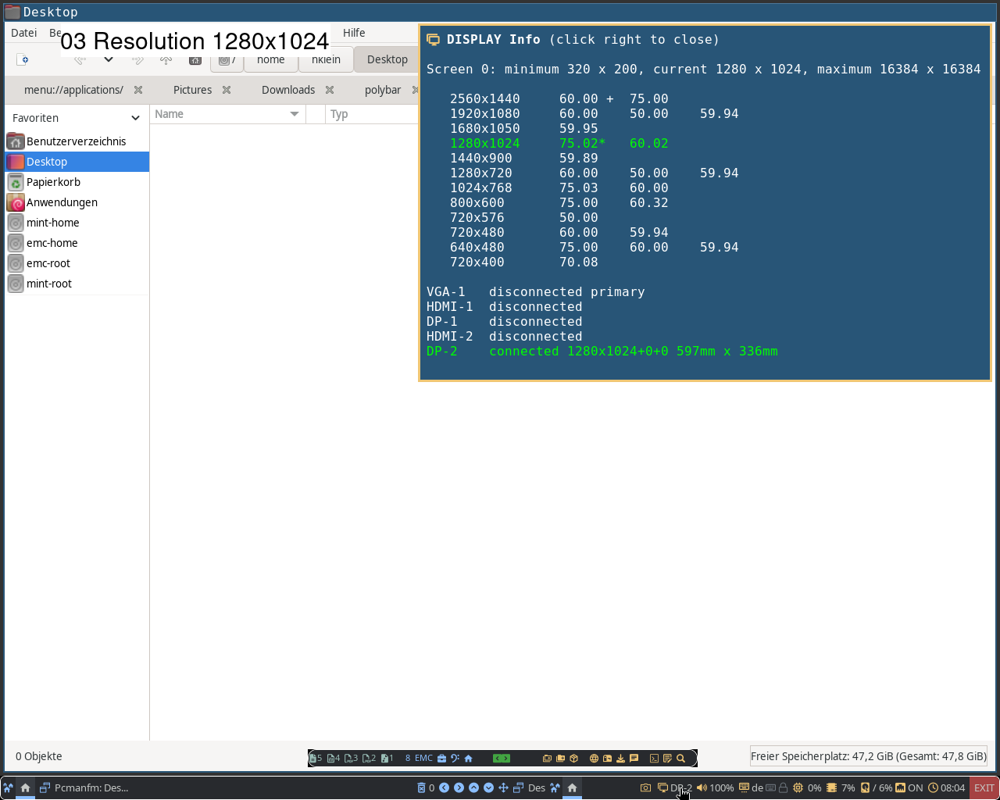</td>
    <td align="center" style="padding-right: 10px;">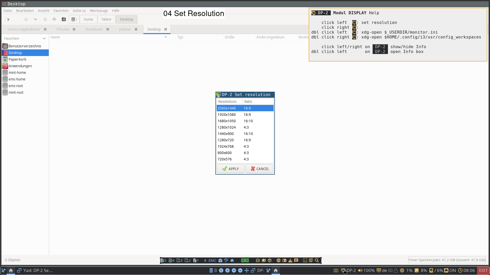</td>
  </tr>
  <tr>
    <td align="center" style="padding-right: 10px;"><small>2560x1440</small></td>
    <td align="center" style="padding-right: 10px;"><small>1920x1080</small></td>
    <td align="center" style="padding-right: 10px;"><small>1280x1024</small></td>
    <td align="center" style="padding-right: 10px;"><small>Set Resolution</small></td>
  </tr>
</table>

<br clear="all">  

```
Supported monitor resolutions (tested on KOORUI E2721F 27"):

  2560x1440
  1920x1080
  1680x1050
  1280x1024
  1440x900
  1280x720
  1024x768

These resolutions should work well on 24" monitors.

Supported monitor resolutions (tested on Acer 20"):

  1600x900
  1366x768.

Other monitor sizes or resolutions may require manual adjustments to font sizes and gaps.

Resolutions are defined in monitor_1234x5678.ini template files.
The current resolution is stored in the monitor.ini which is used by Polybar
to adjust mainbar and launchbar settings.

You can find examples in the monitor directory.  
```
  
view [monitor.ini](monitor) templates  

</details>

  
<details>
<summary>Installation</summary>
  
<br>Screenshots:

<table align="left" style="border: none; border-collapse: collapse;">
  <tr>
    <td align="center" style="padding-right: 10px; padding-bottom: 5px;">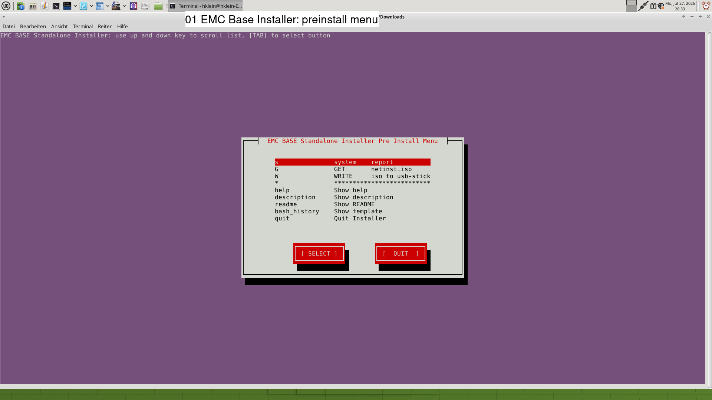</td>
    <td align="center" style="padding-right: 10px; padding-bottom: 5px;">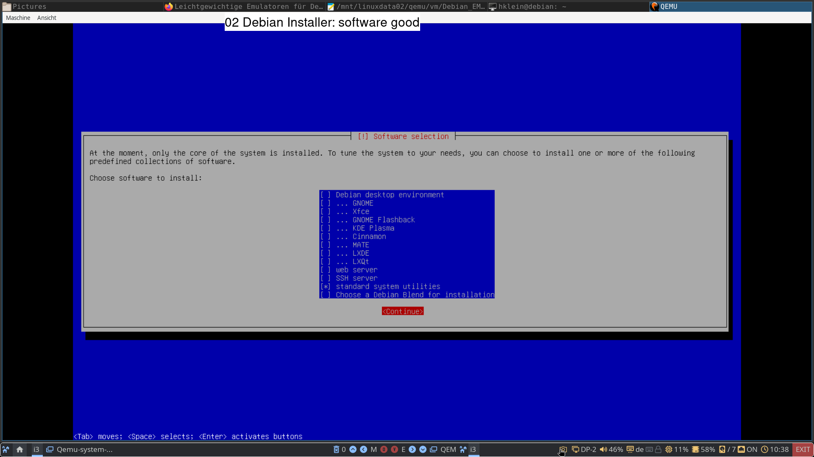</td>
    <td align="center" style="padding-right: 10px; padding-bottom: 5px;">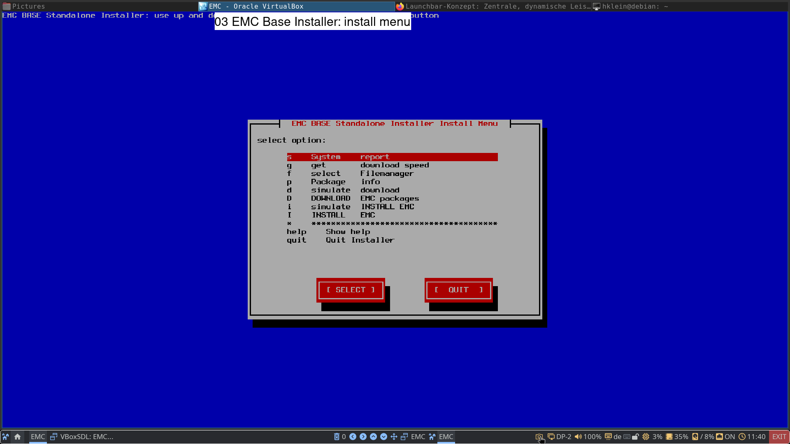</td>
    <td align="center" style="padding-right: 10px; padding-bottom: 5px;">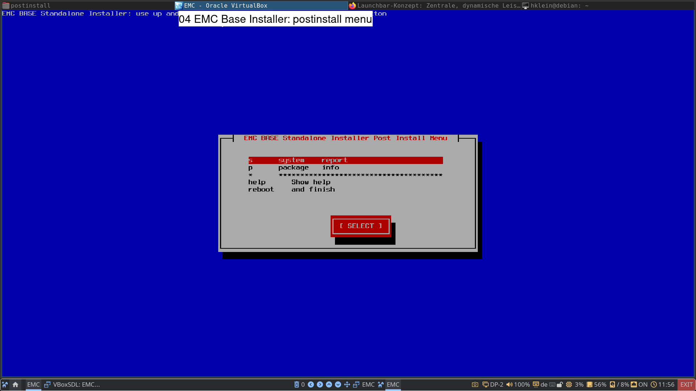</td>
  </tr>
  <tr>
    <td align="center" style="padding-right: 10px;"><small>EMC Preinstall Menu</small></td>
    <td align="center" style="padding-right: 10px;"><small>Debian Software Selection</small></td>
    <td align="center" style="padding-right: 10px;"><small>EMC Install Menu</small></td>
    <td align="center" style="padding-right: 10px;"><small>EMC Postinstall Menu</small></td>
  </tr>
</table>

<br clear="all">

```
The installer will set up the EMC standalone desktop on a minimal Debian system.  
Before install you must download a Debian netinst iso file and install a Debian minimal system.  
Use the installer to get this iso and write it to a usb stick.  
  
NOTE: Uninstalling EMC is not supported. To revert, reinstall Linux and select your preferred desktop environment.  
  
Installation consists of four steps:  
  
Step 1 (Preinstall)    : Download the Debian netinstall ISO and write it to a USB stick.
Step 2 (Install Debian): Install Debian minimal system from USB stick.  
Step 3 (Install EMC)   : Download EMC packages and perform the installation.  
Step 4 (Postinstall)   : View installation results and reboot.  
  
Steps 1, 3 and 4  have own menu and help sections. Use 'help' for more information!

When installing Debian on step 2

   - use Install not Graphical install to avoid tiny fonts
   - choose manual partition when you are asked for
   - REMOVE presets and ACTIVATE ONLY standard system utilities on software selection!

  for detailed info view screenshots in guidance.
```


  view [package info](packages.md)   
  download [guidance](screenshots/archives/Debian_netinst_screenshots.tar.gz) how to install a Debian minimal system  
  download [Installer](EMC_INSTALL_standalone.tar.gz)  

```
Every time EMC starts, a log file is created and the previous one is overwritten. 
This log file is saved at `/tmp/EMC_launch.log`.
```

  view [EMC_launch.log](logfiles/EMC_launch.log)  
  report [issues](https://github.com/xdpetx/EMC-Commander-beta/issues) or give [feedback](https://github.com/xdpetx/EMC-Commander-beta/discussions/categories/feedback)    

</details>

  
<details>
<summary>EMC Info and Help System</summary>

<br>Screenshots:

<table align="left" style="border: none; border-collapse: collapse;">
  <!-- row 1: Info-->
  <tr>
    <td align="center" style="padding-right: 15px; padding-bottom: 5px;">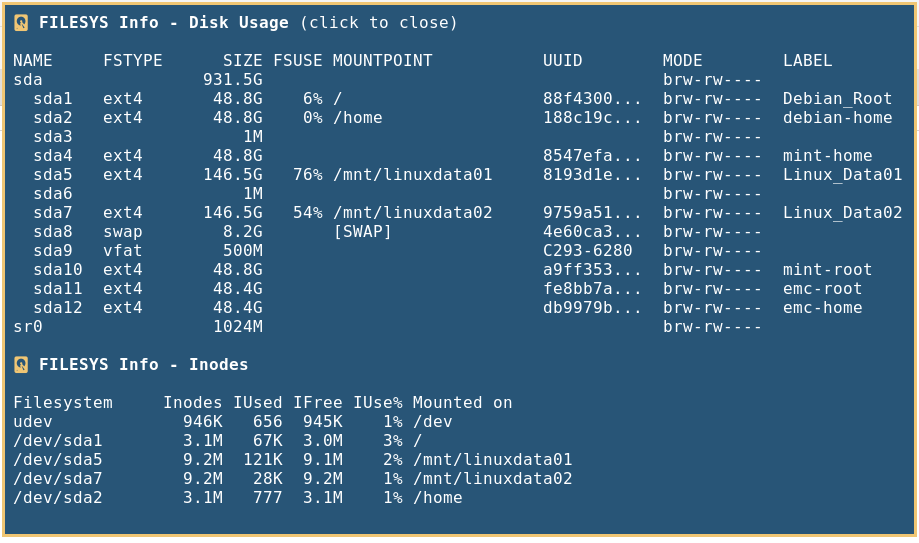</td>
    <td align="center" style="padding-bottom: 5px;">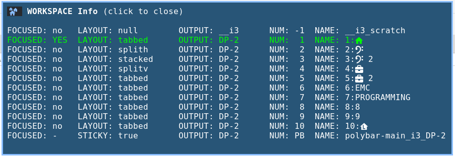</td>
  </tr>
  
  <!-- row 2: Help -->
  <tr>
    <td align="center" style="padding-right: 15px; padding-bottom: 15px;">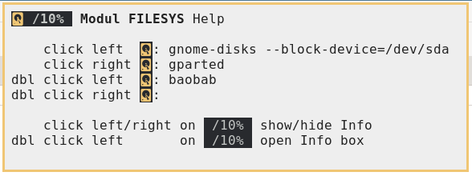</td>
    <td align="center" style="padding-bottom: 15px;">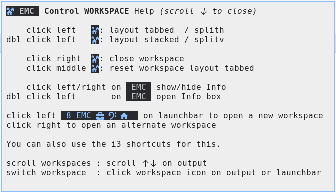</td>
  </tr>
  
  <!-- row 3: icons - centered below the column -->
  <tr>
    <td align="center" style="padding-right: 15px; padding-bottom: 3px;"></td>
    <td align="center" style="padding-bottom: 3px;"></td>
  </tr>

  <!-- row 4: Subtitles -->
  <tr>
    <td align="center" style="padding-right: 15px;"><small>Filesys Module</small></td>
    <td align="center"><small>Workspace Control</small></td>
  </tr>
</table>

<br clear="all">
<br clear="all">

```
all Modules and Controls can display a help
Modules with output can show  a more detailed info
  
sroll ⬆️⬇️ on icon to show help
click on output for detailed info

click on mainbar or launchbar space to show mainbar- or launchbar info
click right on mainbar space closes all infos
            on info or help closes all notifies

Info and help can be displayed together at the same time.
The help is always displayed below the info.
If either one is closed, the other remains open.
A right-click in either window closes both.

At lower resolutions, it may happen that the help text cannot be displayed completely
when both info and help are shown.
```

download [EMC Modules](screenshots/archives/EMC_Modules.tar.gz) screenshot archive  
download [EMC Controls](screenshots/archives/EMC_Controls.tar.gz) screenshot archive  

</details>

<details>
<summary>App Installer</summary>

<br>Screenshots:

<table align="left" style="border: none; border-collapse: collapse;">
  <tr>
    <td align="center" style="padding-right: 10px; padding-bottom: 5px;">
      <a href="screenshots/app_installer/01_EMC_App_installer_first_run.png" target="_blank">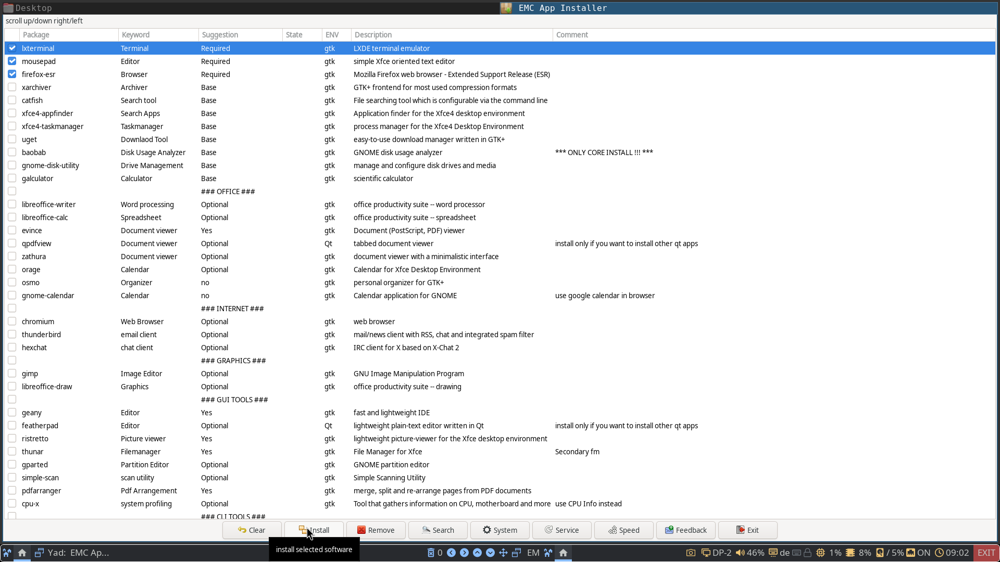</a>
    </td>
    <td align="center" style="padding-right: 10px; padding-bottom: 5px;">
      <a href="screenshots/app_installer/02_EMC_App_installer_firefox_simulation_full_install.png" target="_blank">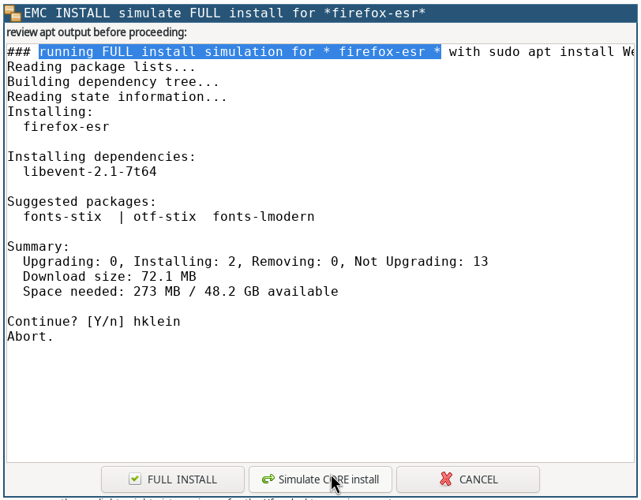</a>
    </td>
    <td align="center" style="padding-right: 10px; padding-bottom: 5px;">
      <a href="screenshots/app_installer/03_EMC_App_installer_firefox_simulation_core_install.png" target="_blank">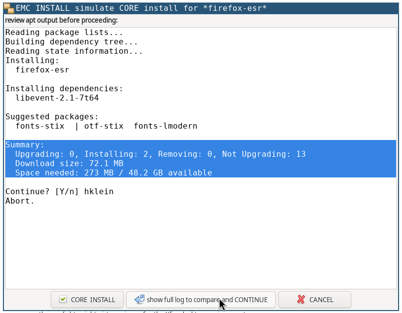</a>
    </td>
    <td align="center" style="padding-right: 10px; padding-bottom: 5px;">
      <a href="screenshots/app_installer/05_EMC_App_installer_firefox_full_install.png" target="_blank">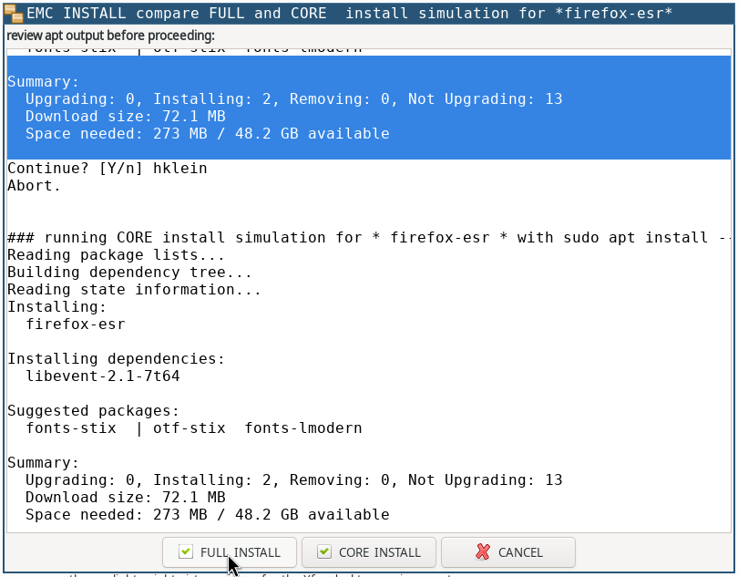</a>
    </td>
    <td align="center" style="padding-right: 10px; padding-bottom: 5px;">
      <a href="screenshots/app_installer/04_EMC_App_installer_firefox_install_progress.png" target="_blank">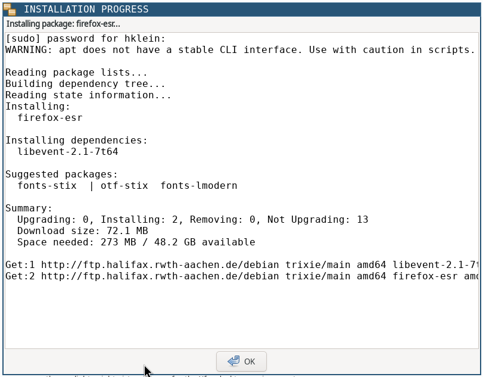</a>
    </td>
    <td align="center" style="padding-right: 10px; padding-bottom: 5px;">
      <a href="screenshots/app_installer/06_EMC_App_installer_firefox_install_progress_done.png" target="_blank">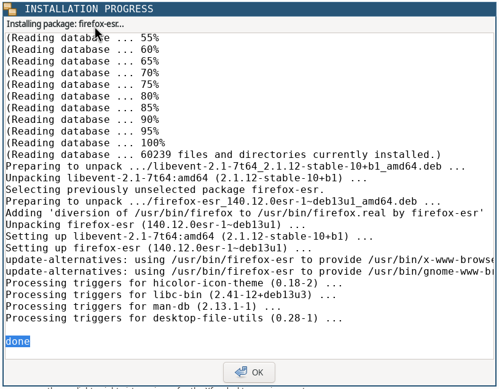</a>
    </td>
    <td align="center" style="padding-right: 10px; padding-bottom: 5px;">
      <a href="screenshots/app_installer/07_EMC_App_installer_install_log.png" target="_blank">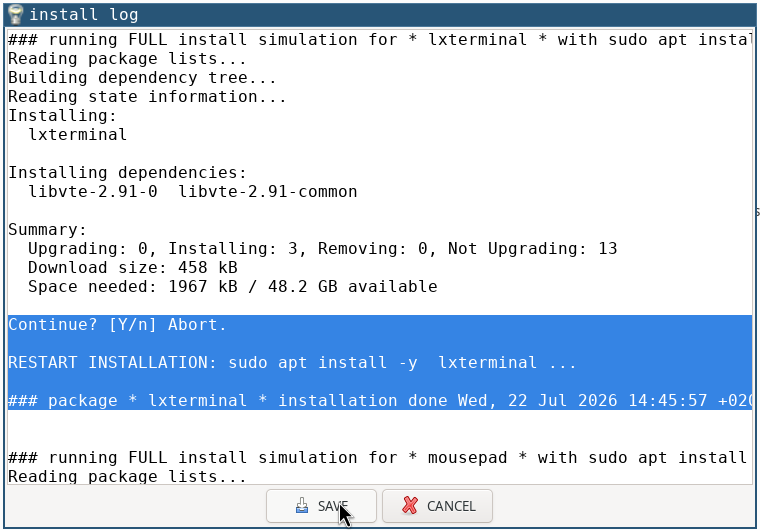</a>
    </td>
    <td align="center" style="padding-bottom: 5px;">
      <a href="screenshots/app_installer/08_EMC_app_installer_base_apps_baobab_warning_core.png" target="_blank">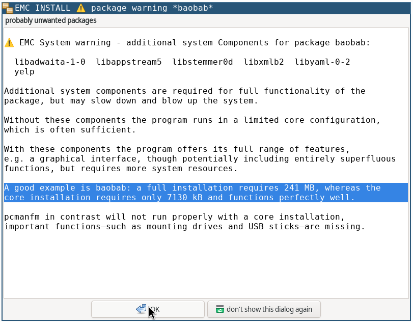</a>
    </td>
  </tr>
  <tr>
    <td align="center" style="padding-right: 10px;"><small>First Run</small></td>
    <td align="center" style="padding-right: 10px;"><small>Full Sim</small></td>
    <td align="center" style="padding-right: 10px;"><small>Core Sim</small></td>
    <td align="center" style="padding-right: 10px;"><small>Full Install</small></td>
    <td align="center" style="padding-right: 10px;"><small>Progress</small></td>
    <td align="center" style="padding-right: 10px;"><small>Done</small></td>
    <td align="center" style="padding-right: 10px;"><small>Log</small></td>
    <td align="center"><small>Warning</small></td>
  </tr>
</table>

<br clear="all">

```
EMC features its own software installer.

Unlike Synaptic, it offers a choice and comparison between a full or core installation
and displays both dependencies and the required disk space.

Furthermore, it warns before installation about potentially superfluous components
that unnecessarily consume disk space and computer resources.

Upon completion of the installation, a log is displayed which can be saved.

Using the [Check System] button, a system report can be displayed and saved.

Via the [Search] button, unlisted applications or libraries can also be installed.
However, the search function is limited to displaying a maximum of 500 results.

Software to be removed is fundamentally uninstalled completely along with all its components,
which corresponds to the complete removal option in Synaptic.
```

<table align="left" style="border: none; border-collapse: collapse;">
  <tr>
    <td align="center" style="padding-right: 10px; padding-bottom: 5px;">
      <a href="screenshots/app_installer/10_EMC_app_installer_install_log.png" target="_blank">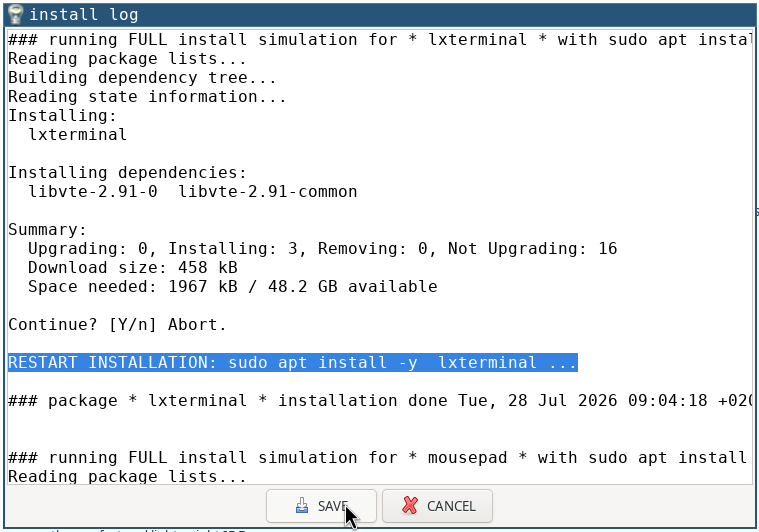</a>
    </td>
    <td align="center" style="padding-right: 10px; padding-bottom: 5px;">
      <a href="screenshots/app_installer/11_EMC_app_installer_install_log_save.png" target="_blank">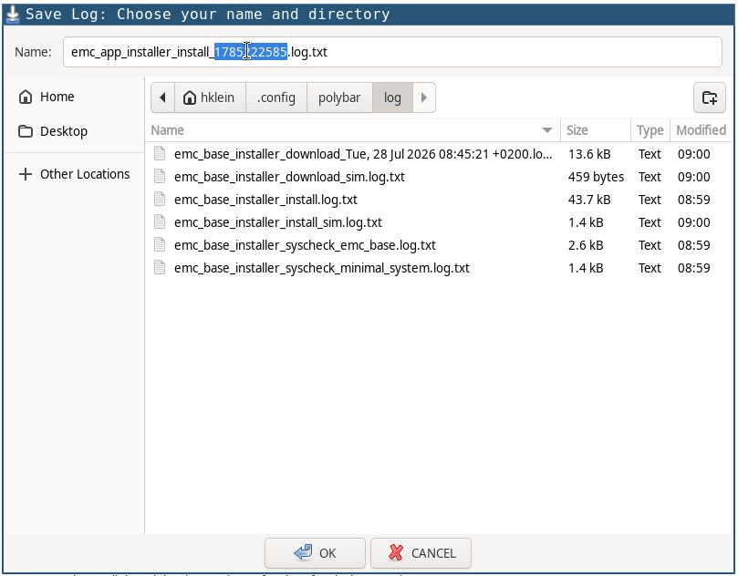</a>
    </td>
    <td align="center" style="padding-right: 10px; padding-bottom: 5px;">
      <a href="screenshots/app_installer/12_EMC_app_installer_install_log_done.png" target="_blank">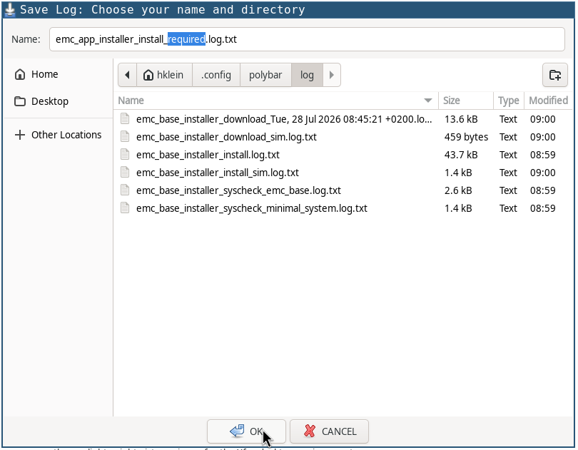</a>
    </td>
    <td align="center" style="padding-right: 10px; padding-bottom: 5px;">
      <a href="screenshots/app_installer/13_EMC_app_installer_syscheck_log.png" target="_blank">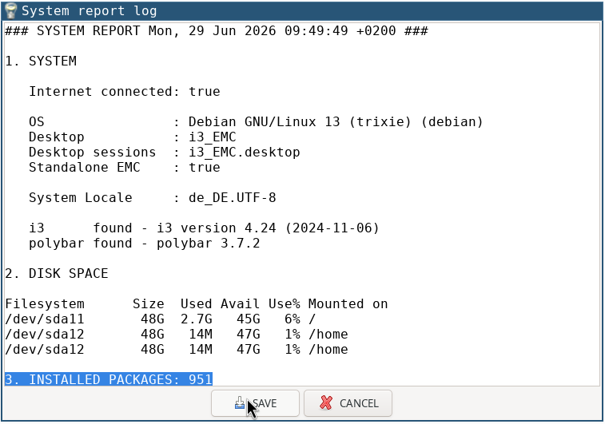</a>
    </td>
    <td align="center" style="padding-right: 10px; padding-bottom: 5px;">
      <a href="screenshots/app_installer/14_EMC_app_installer_save_syscheck_log.png" target="_blank">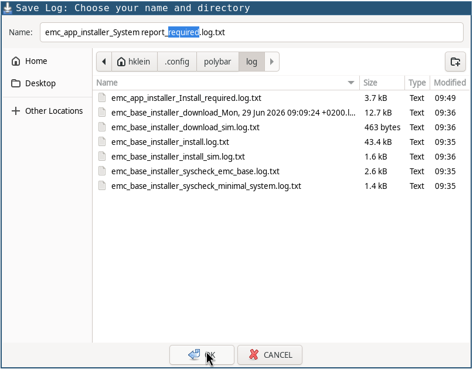</a>
    </td>
  </tr>
  <tr>
    <td align="center" style="padding-right: 10px;"><small>Install log</small></td>
    <td align="center" style="padding-right: 10px;"><small>Install log save</small></td>
    <td align="center" style="padding-right: 10px;"><small>Install log done</small></td>
    <td align="center" style="padding-right: 10px;"><small>System Report log</small></td>
    <td align="center" style="padding-right: 10px;"><small>System Report done</small></td>
  </tr>
</table>

<br clear="all">


```
Every install, remove, or system action creates a log file.
These log files are displayed directly in a window for review.
Once checked, you can rename and store these log files in the `polybar/log` directory.
```

[system report minimal system](logfiles/01_emc_base_installer_syscheck_minimal_system.log.txt) &nbsp;&nbsp;|&nbsp;&nbsp;
[system report EMC Base system](logfiles/06_emc_base_installer_syscheck_emc_base.log.txt) &nbsp;&nbsp;|&nbsp;&nbsp; 
[system report EMC Apps required](logfiles/11_emc_app_installer_System_report_required.log.txt)

```
It is recommended to create a system report after every major installation. 
This helps maintain an overview and prevents the system from bloating.
```

download [log file](logfiles/logfiles.tar.gz) archive   

</details>

<details>
<summary>Configuration</summary>

<br>Screenshot:

<table align="left" style="border: none; border-collapse: collapse;">
  <tr>
    <td align="center" style="padding-bottom: 5px;">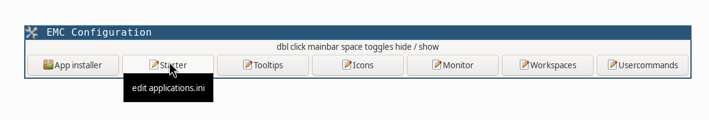</td>
  </tr>
  <tr>
    <td align="center"><small>Toolbar Configuration</small></td>
  </tr>
</table>

<br clear="all">

```

EMC is largely freely configurable.
Nevertheless, EMC is pre-configured to cover a wide range of applications.

You can change the default settings, but you don't have to.
You can largely customize the appearance and functionality to your preferences, or simply make a few minor changes.

The interface for this is the `applications.ini` file.
This file defines the number and arrangement of available modules in the main bar,
as well as the number and arrangement of starters in the launch bars.
The actions triggered by the starters are also defined here.

Tooltips for the starters in the launch bar are defined in tooltips.ini.
The visual appearance is defined in icons.ini; the icons for the starters can be changed here.
The icons for the 10 available workspaces are specified in config_workspaces.

Use the Config Toolbar to edit these files to customize the EMC to your preferences.
dbl click left on mainbar space opens/closes the toolbar.
```


view [configuration](README_config.md) files

</details>
  
Download [other screenshot archives](screenshots/archives) if you want to view all screenshots.  
